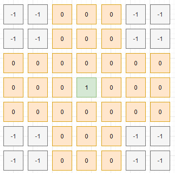

# Peg Solitaire Solver
This project implements a solver for the Peg Solitaire game using the A* algorithm.
## Students
- Deyner Navarro Badilla
- Pablo Arias Navarro
- Felipe Obando Arrieta


#### The goal is to end with only one peg in the center:

<p align="center">
  
</p>

## Files

- `main.py`: Main file that runs the A* algorithm to solve the game.
- `AStar_Algorithm.py`: Contains the implementation of the A* algorithm.

## Usage

To run the solver, simply execute the `main.py` file:

```bash
python main.py